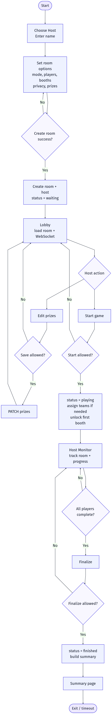
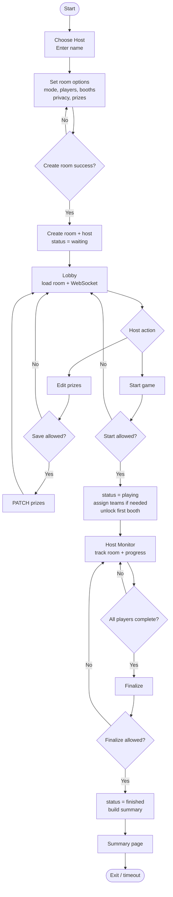

# Host Activity Diagram

This diagram is based on the current host flow implemented in:

- `Frontend/src/App.jsx`
- `Frontend/src/pages/Host.jsx`
- `Frontend/src/pages/Lobby.jsx`
- `Frontend/src/pages/FestivalMap.jsx`
- `Backend/controllers/room_controller.go`

Notes:

- `Create room success?` covers both frontend validation and backend room creation.
- `Save allowed?` means the requester is the host and the room is still `waiting`.
- `Start allowed?` means the requester is the host and the room can move from `waiting` to `playing`.
- In `team` mode, the backend assigns teams before players start the booth sequence.
- `Finalize allowed?` means the requester is the host and every non-host player has completed every selected booth.
