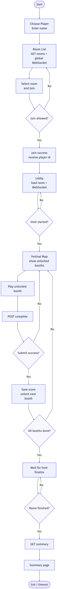
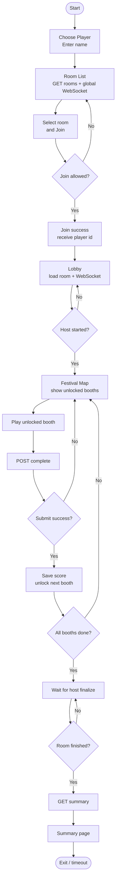

# Player Activity Diagram

This diagram is based on the current player flow implemented in:

- `Frontend/src/App.jsx`
- `Frontend/src/pages/RoomList.jsx`
- `Frontend/src/pages/Lobby.jsx`
- `Frontend/src/pages/FestivalMap.jsx`
- `Frontend/src/pages/SummaryPage.jsx`
- `Backend/controllers/room_controller.go`

Notes:

- `Join allowed?` covers room availability, duplicate-name checks, and password checks for private rooms.
- A player can only enter booths that are currently unlocked by the progress system.
- `Submit success?` means the room is active and the selected booth is currently unlocked for that player.
- After each successful submission, the backend saves score and unlocks the next booth in the selected sequence.
- Even after the player finishes every booth, the summary appears only after the host finalizes the room.
